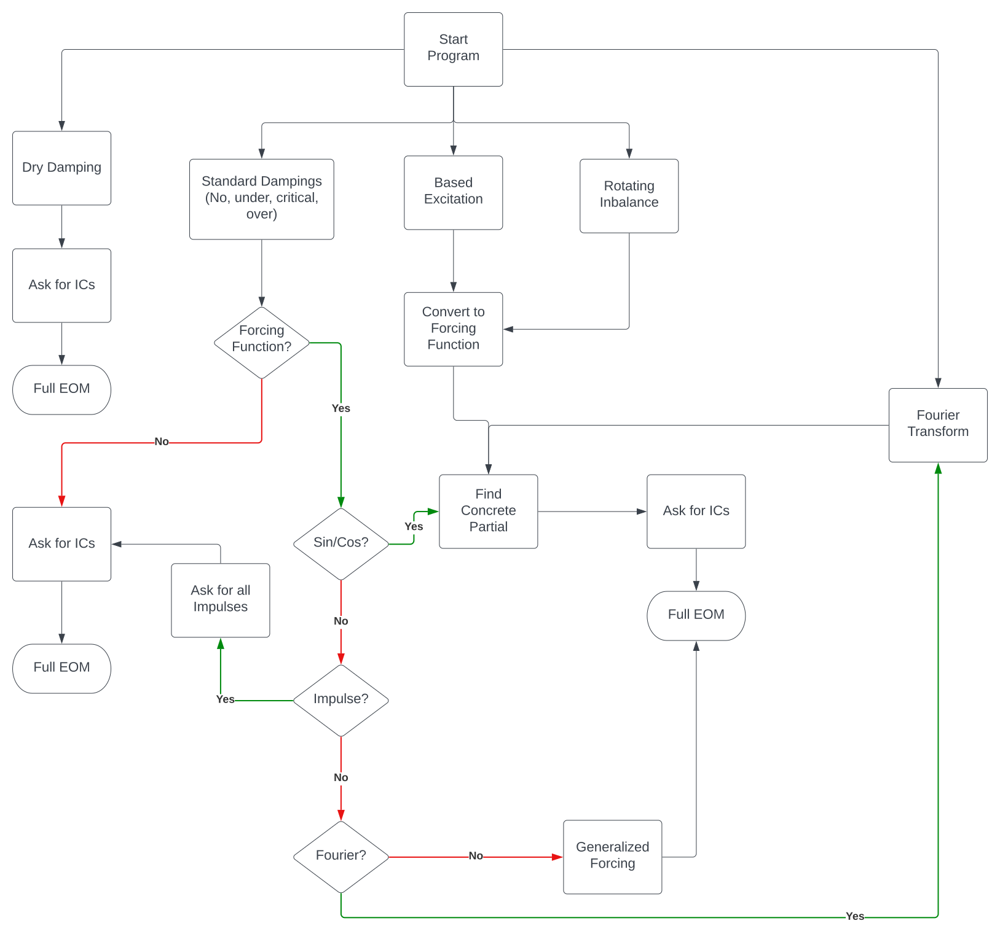

# Basic Vibrations Problem Solver

## Basic Info
This series of Matlab (.m) files come together to form a cohesive framework to answer most basic vibration questions. This includes:
- Undamped, viscous damping, and dry damping responses
- Fourier transforms
- Rotating unbalance problems (rotating mass is source of vibration)
- Based excitation (moving base is source of the vibration)

More advanced and refined options are available within the program itself.

## Methodology and Strategy
A key strategy is to use concrete, exact equations whenever possible. Many of Matlab differential equations methods (namely ode45) are inexact by nature. A key application of this is determination of constants in response functions. These could be solved via a slew of Matlab methods, but exact equations are better (and faster).

The program attempts to follow a logical and consistent flow. This flow should account for as many possible outcomes. I.e. initial conditions, possible forcing functions, simplification of these forcing functions. A logical flowchart is in the form of a LucidChart diagram.

